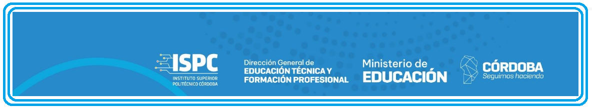

# Proyecto Final  
# Unidad 1 - Capa de Percepción

## Docente
Cristian Gonzalo Vera

## Integrantes  
**Completar indicando tkSP1Urgentes completas**  

- Cristian Gonzalo Vera, GitHub: [@usuario1](https://github.com/usuario1). [**tkSP1Urgentes**]
- Cristian Gonzalo Vera, GitHub: [@usuario2](https://github.com/usuario2) [**tkSP1Urgentes**]
- Nombre Alumno 3, GitHub: [@usuario3](https://github.com/usuario3) [**tkSP1Urgentes**]
- Nombre Alumno 4, GitHub: [@usuario4](https://github.com/usuario4) [**tkSP1Urgentes**]
- Nombre Alumno 5, GitHub: [@usuario5](https://github.com/usuario5) [**tkSP1Urgentes**]
- Nombre Alumno 6, GitHub: [@usuario6](https://github.com/usuario6) [**tkSP1Urgentes**]
- Nombre Alumno 7, GitHub: [@usuario7](https://github.com/usuario7) [**tkSP1Urgentes**]
- Nombre Alumno 8, GitHub: [@usuario8](https://github.com/usuario8) [**tkSP1Urgentes**]

**ISSUE 1 completada** Todos crearon cuentas de github.  
**ISSUE 2 completada** Todos se sumaron al equipo.  
**ISSUE 3 completada** Todos instalaron y configuraron git.  
**ISSUE 4 completada** Todos instalaron y configuraron VSCode.  
**ISSUE 5 completada** Se elige proyecto: "Nombre".  

## Sobre el Repositorio
Este repositorio está dedicado al desarrollo de la capa de percepción para sistemas IoT, como parte del proyecto final de la asignatura. El repositorio está organizado en varias carpetas, cada una con un propósito específico:
- `requisitos`: Documentos con los requerimientos específicos del proyecto proporcionados por el docente.
- `investigación`: Documentos y recursos investigados por los alumnos para el desarrollo del prototipo.
- `prototipo`: Esquemas, Código fuente, Circuitos, Simulaciones y/o implementacion del prototipo en desarrollo.
- `presentación`: Materiales para la presentación del prototipo, incluidos manuales, videos y presentaciones.

## Resumen de Avances
### Semana 1: (08/04 - 14/04)
- Avance del Proyecto Final: Introducción al IoT, formación de equipos.
- Sprint 1: Familiarización con el entorno de desarrollo y herramientas de colaboración.

### Semana 2: (15/04 - 21/04)
- Avance del Proyecto Final: Fundamentos de programación para IoT. Introducción a los controladores (ESP32).
- Sprint 2: Comprensión y experimentación con programación IoT.

### Semana 3: (22/04 - 28/04)
- Avance del Proyecto Final: Sensores en IoT: tipos, selección y aplicación.
- Sprint 3: Desarrollo inicial del controlador para la capa de percepción.

### Semana 4: (29/04 - 05/05)
- Avance del Proyecto Final: Taller práctico sobre sensores y actuadores.
- Sprint 4: Finalización del desarrollo del controlador, integración con sensores y actuadores.

## Estado Actual del Desarrollo
- Actualmente trabajando en el Sprint 1, "Introducción al IoT, formación de equipos.".

## Stack Tecnológicos Utilizados
- Scrum
- Kanban
- VsCode + extensiones (PlatformIO, Wokwi)
- Tinkercad (opcional para pruebas iniciales)  
  
## Video Presentación
[Link al video de presentación del avance actual](URL_DEL_VIDEO)  

## Licencia  
Licencia para Software y Hardware del Proyecto IoT

### Licencia de Software
El software incluido en este proyecto se distribuye bajo la Licencia MIT, que permite el uso, copia, modificación, fusión, publicación, distribución, sublicencia y/o venta de copias del software bajo las siguientes condiciones:

El aviso de derechos de autor y este permiso deben incluirse en todas las copias o porciones sustanciales del software.

### Licencia de Hardware
El hardware asociado con este proyecto está sujeto a una licencia permisiva similar a la CERN OHL v2, con la siguiente modificación para usos comerciales:

El hardware y cualquier diseño o documentación relacionada se pueden utilizar libremente para fines educativos y de investigación sin restricciones. Para cualquier uso comercial de este hardware, los diseños o la documentación asociada, se debe obtener una autorización expresa de los autores originales del proyecto.

### Condiciones Generales
Para ambos software y hardware:
- Uso educativo: Permitido sin restricción.
- Uso comercial: Requiere autorización expresa por parte de los titulares de derechos de autor originales antes de cualquier uso comercial o distribución.

Los detalles de contacto para solicitudes de autorización están disponibles en [Información de Contacto del Titular de Derechos de Autor] o se pueden obtener a través de la institución educativa responsable del proyecto.
Este proyecto está licenciado bajo [nombre de la licencia], disponible en este [link al archivo LICENSE](LICENSE).

 
  
    
